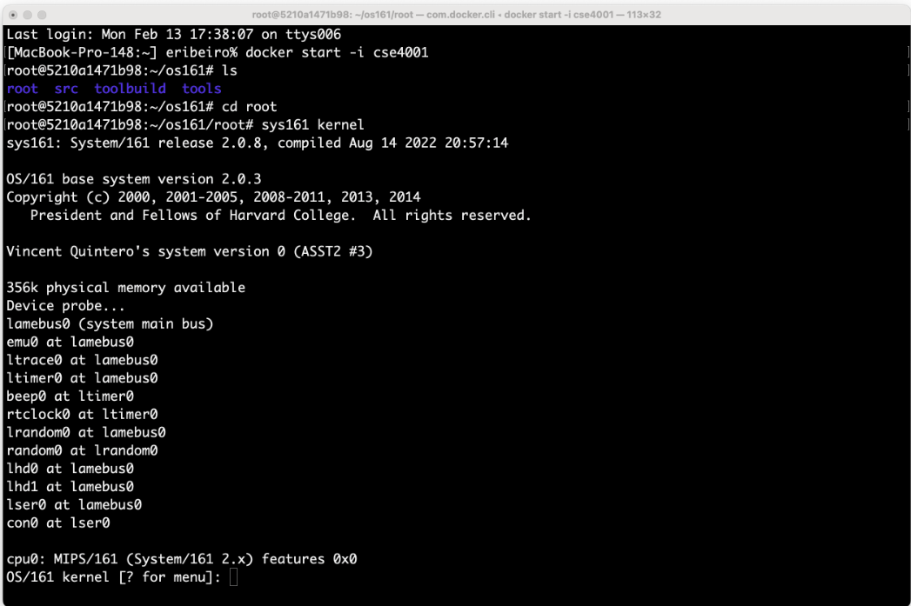

# install-the-cse4001-docker-assignment

## Assignment (CSE4001): Install the CSE4001 docker container

In this assignment, you will install OS/161 on your personal computer so you can have it ready for the following OS/161 assignments. 

- [Installing OS/161](https://fit.instructure.com/courses/639948/pages/installing-os-slash-161)

Make a small change in the kernel. Re-build and boot the kernel so it shows the change that has been made. To make the change, search for the string "Put-your-group-name-here" and replace it with your name. 

### Deliverables: 

- Edit this README.md (markdown file) so it shows a screenshot of your OS/161 running showing the new booting sequence with your name on it. The screenshot file is an image, e.g., png, jpg, gif. The image file must also be uploaded in the without repository.
  
**Note**: I just want to quickly see that you completed the tasks asked by the assignment. For example, if everything fits in your screen, you can take a screenshot of the result of all terminals and debugging script side by side as they appear on your computer. 

$${\color{lightgreen}{\text{Add screenshots here!!}}}$$

The following image is just an example of how to add an image in markdown. 
To add your actual screenshot, edit this README.md file, and replace the name of the example image file with the name of your screenshot image. Of course, you also need to add the image file to the repository so it is rendered properly by GitHub. 

